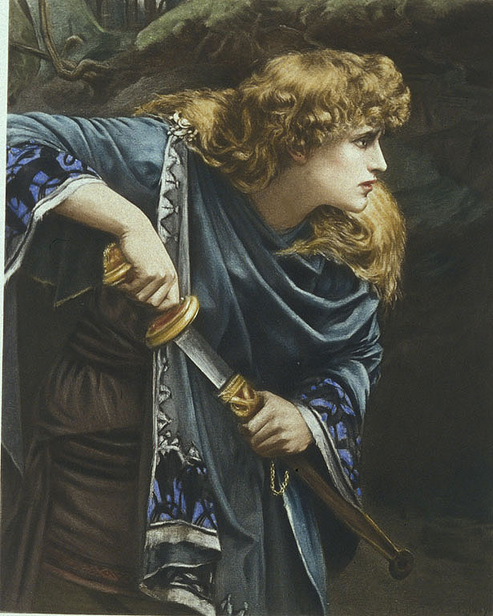

# imogen

A system to build, publish, and curate Kubernetes node "reference images" in Azure.

<p align="center">
  
</p>

<p align="center">
  <sub>
    <em>Imogen</em> (c. 1888) by Herbert Gustave Schmalz, depicting the heroine of
    Shakespeare's <em>Cymbeline</em>. Public domain, via
    <a href="https://commons.wikimedia.org/wiki/File:Imogen_-_Herbert_Gustave_Schmalz.jpg">Wikimedia Commons</a>.
  </sub>
</p>

## Features

- Finds current Kubernetes releases without corresponding images in a Community Gallery
- Builds missing images for desired operating systems and distros in a Shared Image Gallery (staging)
- Validates the staging images by bringing them up as nodes in a live Kubernetes cluster
- Publishes validated images to the Community Gallery
- Deletes old, unsupported images from the Community Gallery

## Project layout

- `cmd/imogen-toolserver` — the MCP tool server the agent calls
- `internal/tools` — MCP tool implementations
- `internal/k8s` — upstream Kubernetes release lookups
- `docs/plan.md` — design and MVP plan

## Getting started

You need Go 1.26+. Build and test:

```sh
make build
make test
```

Run the tool server locally over stdio:

```sh
make run
```

## Development

The tool server is written in Go using the [MCP Go SDK](https://github.com/modelcontextprotocol/go-sdk).
Each pipeline action is an MCP tool registered in `internal/tools`. See [AGENTS.md](AGENTS.md) for the
architecture and conventions.

## Design

See [docs/plan.md](docs/plan.md) for the design and MVP plan.

## Contributing

See [CONTRIBUTING.md](CONTRIBUTING.md). To report a security issue, see [SECURITY.md](SECURITY.md).

## Trademarks

This project may contain trademarks or logos for projects, products, or services. Authorized use of
Microsoft trademarks or logos is subject to and must follow
[Microsoft's Trademark & Brand Guidelines](https://www.microsoft.com/en-us/legal/intellectualproperty/trademarks/usage/general).
Use of Microsoft trademarks or logos in modified versions of this project must not cause confusion or
imply Microsoft sponsorship. Any use of third-party trademarks or logos is subject to those
third-parties' policies.

