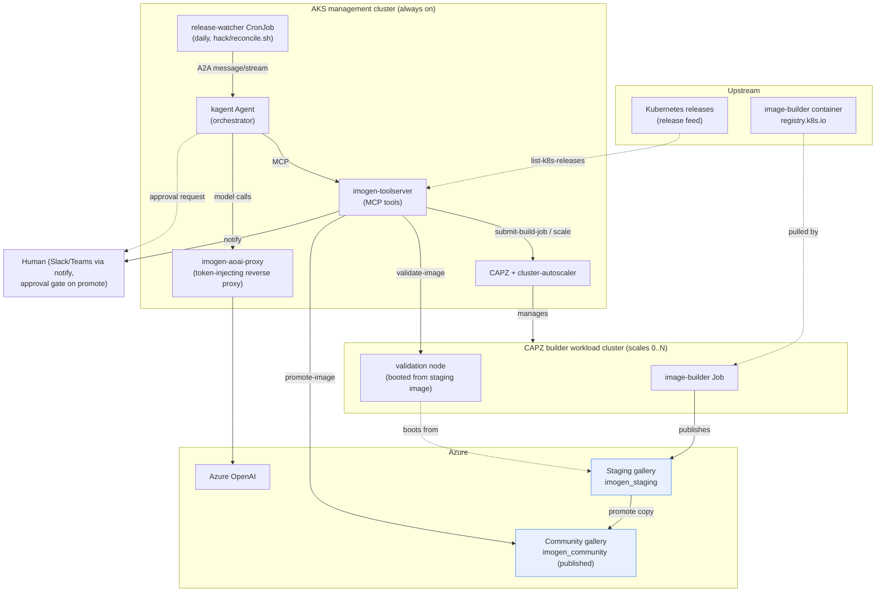
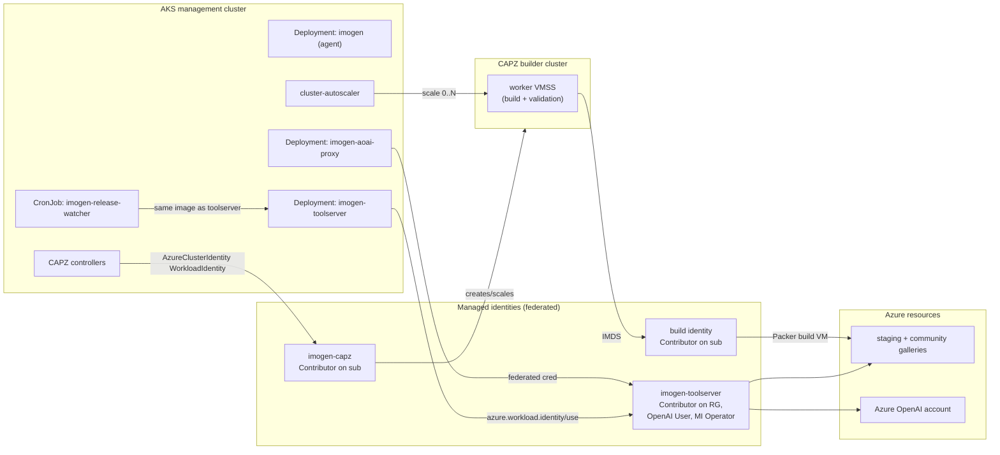
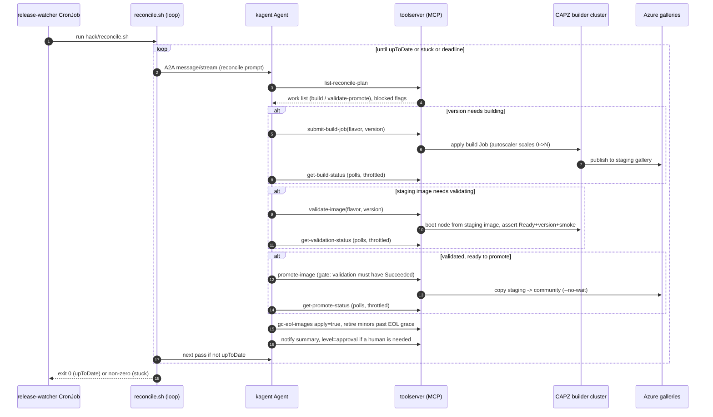

# Architecture

Diagrams of the imogen stack and its moving pieces. These use
[Mermaid](https://mermaid.js.org/), which GitHub renders inline. For the narrative design see
[plan.md](plan.md); for the AI/agentic technologies see [ai-stack.md](ai-stack.md).

## High-level stack

imogen keeps Kubernetes node reference images in an Azure Community Gallery current. A daily trigger
asks a kagent agent to reconcile upstream Kubernetes releases against the published gallery, and the
agent drives a build → validate → promote → retire pipeline exposed as MCP tools. Everything
authenticates to Azure with Workload Identity, so no secrets are stored.

## Deployment and identity

Where each component runs and how it authenticates. The management cluster is always on; the builder
cluster's worker pool scales to zero between runs. Auth is Workload Identity throughout, except the
local kind path which uses the developer's `az` login.

## Reconcile sequence

The unattended daily reconcile. The shell loop (`reconcile.sh`) provides persistence: it re-invokes
the agent each pass until `list-reconcile-plan` reports `upToDate` or `stuck`, because the model
reliably ends a turn while work is still in flight. Builds (Kubernetes Jobs) and validations
(goroutines in the tool server, serialized per OS type) keep running server-side between passes, and
`submit-build-job` / `validate-image` are idempotent, so each pass just promotes whatever finished and
advances the rest. The unattended watcher auto-promotes validated images and auto-retires minors more
than a year past EOL; interactive runs require human approval for both.

